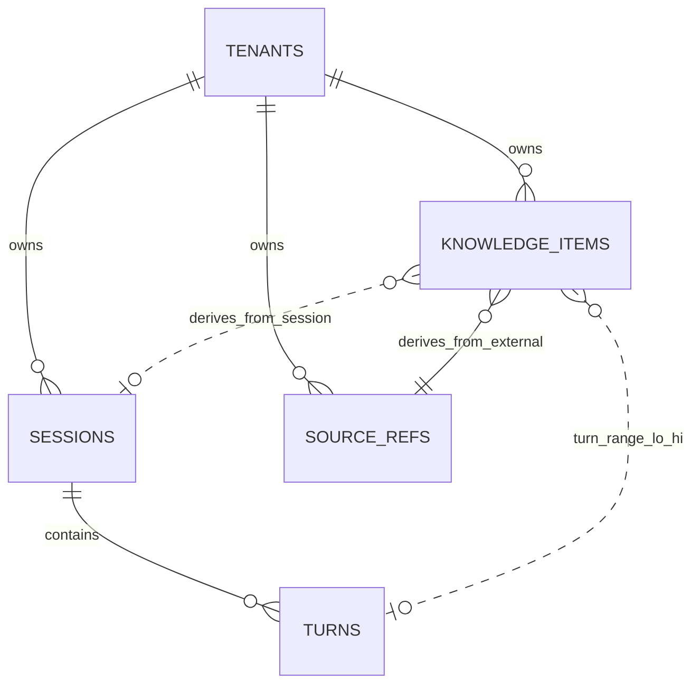

# KnowledgeStore & Distillation Pipeline — Phase 2 Design

> Concrete schema, pipeline, and triggers for the three-layer memory model
> introduced in [ARCHITECTURE.md §4.4](../../ARCHITECTURE.md#44-knowledgestore--issue-9).
> Resolves Phase 2 issues #13–#17.

## Status

**Approved (Phase 2).** Schema changes after this point require a versioned
migration plus an amendment here.

---

## 1. Scope

This document covers:

- The Postgres + pgvector schema for episodic memory (`turns`) and semantic
  memory (`knowledge_items`), with provenance and tenant isolation
- Confidence scoring as decomposed components, computed at retrieval
- The `project_seed` / `user_session` / `external_sync` source-type policy and
  the upgrade-reconciliation procedure
- Distillation triggers and how they coordinate with `JobRunner`
- The Extract → Cognify → Load pipeline with prompt design and dedup semantics
- Embedding model migration strategy (MVP and Phase 5 swap)

Out of scope (deferred):
- Graph layer (`searchRelational`) — Phase 2 opt-in adapter, separate doc
- Cross-process scheduled fan-out — Phase 5
- Auto-prune execution — MVP ships dry-run only
- Embedding model swap *tooling* — Phase 5 (schema affordance is here)

---

## 2. Data Model & SQL Schema — issue #13

### 2.1 Entity overview



### 2.2 DDL

The migration is **templated on `EMBEDDING_DIM`**, substituted at migration time
from the configured `EmbeddingProvider.dimension` (see §8).

```sql
CREATE EXTENSION IF NOT EXISTS vector;
CREATE EXTENSION IF NOT EXISTS pgcrypto;

-- ── Tenants ────────────────────────────────────────────────────────────────
CREATE TABLE tenants (
  id            TEXT PRIMARY KEY,           -- 'default' for single-tenant deployments
  display_name  TEXT NOT NULL,
  created_at    TIMESTAMPTZ NOT NULL DEFAULT now()
);
INSERT INTO tenants (id, display_name) VALUES ('default', 'Default Tenant');

-- ── Sessions ───────────────────────────────────────────────────────────────
CREATE TABLE sessions (
  id                         UUID PRIMARY KEY DEFAULT gen_random_uuid(),
  tenant_id                  TEXT NOT NULL REFERENCES tenants(id),
  channel_kind               TEXT NOT NULL,
  channel_native_ref         TEXT NOT NULL,
  started_at                 TIMESTAMPTZ NOT NULL,
  last_active_at             TIMESTAMPTZ NOT NULL,
  status                     TEXT NOT NULL CHECK (status IN ('active','idle','ended')),
  participants               JSONB NOT NULL DEFAULT '[]'::jsonb,
  metadata                   JSONB NOT NULL DEFAULT '{}'::jsonb,
  -- distillation watermark uses turns.seq_no (BIGINT, orderable)
  distilled_through_seq_no   BIGINT NOT NULL DEFAULT 0,
  UNIQUE (tenant_id, channel_kind, channel_native_ref)
);
CREATE INDEX sessions_idle_idx
  ON sessions (status, last_active_at)
  WHERE status IN ('active','idle');

-- ── Turns (episodic memory) ────────────────────────────────────────────────
CREATE TABLE turns (
  id            UUID PRIMARY KEY DEFAULT gen_random_uuid(),
  seq_no        BIGSERIAL UNIQUE NOT NULL,            -- monotonic, watermark target
  session_id    UUID NOT NULL REFERENCES sessions(id) ON DELETE CASCADE,
  author_role   TEXT NOT NULL CHECK (author_role IN ('user','agent','system')),
  author_ref    JSONB,
  content_text  TEXT NOT NULL,
  content_extra JSONB NOT NULL DEFAULT '{}'::jsonb,
  created_at    TIMESTAMPTZ NOT NULL DEFAULT now(),
  metadata      JSONB NOT NULL DEFAULT '{}'::jsonb    -- token usage, tool calls
);
CREATE INDEX turns_session_seq_idx ON turns (session_id, seq_no);

-- ── Source refs (external knowledge sources) ───────────────────────────────
CREATE TABLE source_refs (
  id          UUID PRIMARY KEY DEFAULT gen_random_uuid(),
  tenant_id   TEXT NOT NULL REFERENCES tenants(id),
  source_kind TEXT NOT NULL,    -- 'github','notion','web','manual', ...
  locator     TEXT NOT NULL,    -- repo:branch:path / url / ...
  metadata    JSONB NOT NULL DEFAULT '{}'::jsonb,
  created_at  TIMESTAMPTZ NOT NULL DEFAULT now(),
  UNIQUE (tenant_id, source_kind, locator)
);

-- ── Knowledge items (semantic memory) ──────────────────────────────────────
CREATE TABLE knowledge_items (
  id                    UUID PRIMARY KEY DEFAULT gen_random_uuid(),
  tenant_id             TEXT NOT NULL REFERENCES tenants(id),
  external_id           TEXT,                                                  -- stable id for project_seed reconciliation
  source_type           TEXT NOT NULL CHECK (source_type IN ('project_seed','user_session','external_sync')),
  kind                  TEXT NOT NULL CHECK (kind IN ('fact','decision','qa_pair','procedure')),
  text                  TEXT NOT NULL,
  text_canonical_hash   CHAR(64) NOT NULL,                                     -- sha256 of normalize(text)
  embedding             vector({{EMBEDDING_DIM}}),                             -- ◀ templated

  -- confidence components (computed snapshot + raw inputs)
  extractor_self_rating NUMERIC(3,2) NOT NULL CHECK (extractor_self_rating BETWEEN 0 AND 1),
  n_confirmations       INT NOT NULL DEFAULT 1,
  last_referenced_at    TIMESTAMPTZ NOT NULL DEFAULT now(),
  confidence_snapshot   NUMERIC(3,2) NOT NULL CHECK (confidence_snapshot BETWEEN 0 AND 1),

  -- provenance (one of two shapes; nulls allowed when source object deleted)
  derived_from_kind     TEXT NOT NULL CHECK (derived_from_kind IN ('session','external')),
  derived_from_session  UUID    REFERENCES sessions(id)   ON DELETE SET NULL,
  derived_from_turn_lo  BIGINT  REFERENCES turns(seq_no)  ON DELETE SET NULL,
  derived_from_turn_hi  BIGINT  REFERENCES turns(seq_no)  ON DELETE SET NULL,
  derived_from_source   UUID    REFERENCES source_refs(id) ON DELETE SET NULL,
  derived_from_locator  TEXT,

  extractor_version     TEXT NOT NULL,
  created_at            TIMESTAMPTZ NOT NULL DEFAULT now(),
  updated_at            TIMESTAMPTZ NOT NULL DEFAULT now(),
  metadata              JSONB NOT NULL DEFAULT '{}'::jsonb,

  CHECK (
    (derived_from_kind='external' AND derived_from_source IS NOT NULL)
 OR  derived_from_kind='session'                                  -- session refs may be NULL after source deletion
  )
);

-- project_seed reconciliation key
CREATE UNIQUE INDEX knowledge_items_seed_external_uniq
  ON knowledge_items (tenant_id, external_id)
  WHERE external_id IS NOT NULL;

-- exact-dup guard: race-safe on concurrent distillation across sessions
CREATE UNIQUE INDEX knowledge_items_canonical_uniq
  ON knowledge_items (tenant_id, source_type, text_canonical_hash);

-- vector retrieval (HNSW: better recall@latency than IVFFlat at MVP scale)
CREATE INDEX knowledge_items_embedding_idx
  ON knowledge_items USING hnsw (embedding vector_cosine_ops);

CREATE INDEX knowledge_items_tenant_kind_idx
  ON knowledge_items (tenant_id, source_type, kind);
```

### 2.3 Schema decisions and rationale

- **`turns.seq_no BIGSERIAL`** is the watermark target — UUIDv4 from
  `gen_random_uuid()` is not orderable, so distillation needs an explicit
  monotonic sequence.
- **`derived_from_*` columns instead of JSONB** preserve referential integrity
  and let the planner use indexes; `ON DELETE SET NULL` ensures session deletion
  isn't permanently blocked by accumulated knowledge references. The CHECK
  constraint allows `derived_from_kind='session'` with all session refs null
  (provenance lost) — adapters tag `metadata.provenance_lost_at = now()` when
  this transition happens.
- **`text_canonical_hash` UNIQUE constraint** (not just index) makes dedup
  race-safe when two sessions' concurrent distillations produce the same
  canonical text. INSERT path uses `ON CONFLICT ... DO UPDATE`.
- **HNSW over IVFFlat**: HNSW gives better recall/latency tradeoff at the
  MVP-relevant scale (<1M items per tenant); rebuild cost difference is
  negligible.
- **Embedding dimension is parameterized**: see §8 for migration story.

---

## 3. Provenance & Confidence — issue #16

### 3.1 ProvenanceRef shape (TypeScript view)

```ts
type ProvenanceRef =
  | { kind: 'session';  sessionId: SessionId | null;
      turnRange:        [BigInt, BigInt] | null;
      provenanceLostAt: Date | null }
  | { kind: 'external'; sourceId: SourceId; locator: string };
```

`session`-derived items can have `sessionId === null` and `turnRange === null`
after the underlying session is deleted. The text and embedding survive; only
precise provenance is lost. `provenanceLostAt` records when.

### 3.2 Confidence: components stored, derived value computed

Storing a single `confidence` snapshot makes recency decay either expensive
(periodic table-wide recompute) or impossible (decay can't run). We split into
**inputs** (immutable or counter-style) and **a snapshot** (recomputed only on
write events):

| Column | Update trigger | Purpose |
|---|---|---|
| `extractor_self_rating` | immutable | LLM's self-reported certainty at extraction |
| `n_confirmations` | dedup hit (insert collision) | Count of independent extractions producing same canonical text |
| `last_referenced_at` | retrieval that returns this item | Drives decay-on-disuse |
| `confidence_snapshot` | dedup hit, recompute via formula | Materialized for fast ranking |

**Snapshot formula** (computed on insert + dedup hit):

```
snap = clamp(
   extractor_self_rating * 0.6
 + duplication_boost(n_confirmations) * 0.4
)
duplication_boost(n) = min(0.5 + 0.1 * (n - 1), 1.0)   // n=1: 0.5, n=2: 0.6, capped 1.0
```

**Recency decay** is **query-time only**, applied as multiplier when
`RetrievalQuery.applyRecencyDecay = true` (default `false`):

```
final_confidence = confidence_snapshot * exp(-days_since_last_referenced / 90)
```

`days_since_last_referenced` is from `last_referenced_at` (decay-on-disuse —
old facts that are still consulted don't decay). MVP retrieval defaults to
the snapshot only; opt-in lets curators surface recently-referenced items.

### 3.3 Confidence rubric (interpretation)

| Range | Meaning | Typical origin |
|---|---|---|
| 0.0–0.3 | Low — single hedged mention | extractor low self-rating, no dedup hits |
| 0.3–0.6 | Medium — explicit but single source | first distillation default range |
| 0.6–0.85 | High — confirmed across sessions | dedup hits 2+ times |
| 0.85–1.0 | Very high — direct user assertion + multiple confirmations | rare auto-assignment |

### 3.4 Confidence usage

- **Retrieval ranking tiebreaker** when cosine score is close
- **Display threshold**: items with `confidence_snapshot < 0.4` get a `low_confidence`
  flag in `RetrievedItem`; UI may hide unless explicitly surfaced
- **Auto-prune candidate set**: `confidence_snapshot < 0.2 AND last_referenced_at < now() - 30 days`
  — MVP exposes this as `agentry prune --dry-run` only, no auto-execution

---

## 4. Source-Type Tagging & Upgrade — issue #17

### 4.1 Three buckets

| `source_type` | Owner | Update trigger | `external_id` | Upgrade behavior |
|---|---|---|---|---|
| `project_seed` | framework upgrade | `agentry upgrade-seed` | **required** | Reconciled by externalId: insert / update / delete |
| `user_session` | distillation pipeline | session ended / idle / manual | optional | **Never touched by upgrade** |
| `external_sync` | KnowledgeSource pull | webhook / scheduled | provided by source (e.g., GitHub file SHA) | **Never touched by upgrade** (source-driven updates only) |

### 4.2 `agentry upgrade-seed` procedure

```
1. Load new seed manifests from docs/seed/*.json
2. Read existing rows: WHERE source_type='project_seed' AND tenant_id=:tenant
3. Compute three-way diff by external_id:
     - new only        → INSERT (compute embedding)
     - both, text diff → UPDATE same id (preserve provenance, recompute embedding, bump updated_at)
     - old only        → DELETE
4. Apply in single transaction
   (DELETE filter MUST include source_type='project_seed' to prevent any chance
    of touching user_session or external_sync rows)
```

**Why preserve `id` on UPDATE**: existing `user_session` items may have referenced
this seed item's text; preserving the row id keeps any external references stable.

### 4.3 Seed manifest format

Single JSON file per item under `docs/seed/`. Files are committed to the framework
repo and shipped to deployments via `git pull` then `agentry upgrade-seed`.

```json
{
  "externalId": "agentry.deploy.docker-compose-up",
  "version": 1,
  "kind": "procedure",
  "text": "Deploy via 'docker compose up' from the repo root after copying .env.example to .env. Postgres migrations run automatically on first boot.",
  "metadata": { "tags": ["deploy", "docker"] }
}
```

`version` bumps on text change — used by upgrade-seed to short-circuit identical
items.

### 4.4 Tenant isolation note

Distillation reads turns from a single session, which belongs to a single tenant.
Cross-tenant leakage during distillation is **structurally impossible** — there
is no cross-session aggregation in the pipeline.

---

## 5. Distillation Triggers — issue #14

### 5.1 Trigger types

```ts
type DistillationCriteria =
  | { kind: 'session_ended'; sessionId: SessionId }
  | { kind: 'idle';          idleSinceMin: number }       // batch
  | { kind: 'manual';        sessionId: SessionId }
  | { kind: 'rolling';       sessionId: SessionId; everyNTurns: number };  // opt-in only
```

### 5.2 Default policy

| Trigger | Default policy | JobRunner key |
|---|---|---|
| Session ended (`status` → `'ended'`) | Immediate enqueue on transition | `distill:${sessionId}` |
| Idle (60 min, no activity) | Scheduled sweep every 6 h batches all idle sessions | `distill:scheduled` (single-flight) |
| Manual (`agentry distill --session <id>`) | Immediate enqueue | `distill:${sessionId}` |
| Rolling (every N=20 turns within active session) | **disabled by default** — opt-in for long active sessions | `distill:${sessionId}` |

Per-session distillation goes through the same JobRunner key as `recordTurn` for
that session, so distillation and incoming turns are fully serialized — no race.

### 5.3 Active → idle transition (lazy)

There is no dedicated transition daemon. `status='active' → 'idle'` happens at
two points:

1. **On every incoming event** (cheap): same-tenant sessions where
   `status='active' AND last_active_at < now() - idleTimeout` are bulk-updated
   to `'idle'` in the same handler.
2. **At the start of the scheduled distillation sweep**: same query, runs on
   schedule even when no events arrive at all (covers idle workspaces).

Lazy detection introduces small latency in the `idle` flag, which is acceptable
because distillation triggers don't need millisecond precision.

### 5.4 Watermark and idempotency

`sessions.distilled_through_seq_no` advances **only after a successful Load
phase** for that range. Distillation always processes
`WHERE turns.session_id = ? AND turns.seq_no > distilled_through_seq_no`,
so retries on failed runs are naturally idempotent.

### 5.5 Scheduled sweep scaling note (Phase 5)

MVP runs the sweep under a single `distill:scheduled` key — fully serial across
all idle sessions. With many tenants this becomes a throughput bottleneck.
Phase 5 evolution: the sweep enqueues per-session jobs (`distill:${sessionId}`)
and returns immediately, fanning out under per-key parallelism.

---

## 6. Extract → Cognify → Load Pipeline — issue #15

### 6.1 Extract — atomic knowledge from a turn range

The distillation pipeline uses a **dedicated AgentRunner instance** with
`workdir = seed/distillation-workdir/`. The separate workdir keeps the
distillation prompt and tools isolated from conversational replies.

**Distillation prompt template**:

```
You are a knowledge extractor. Read the conversation transcript below and
extract atomic, self-contained knowledge items.

For each item, output JSON with this shape:

{
  "kind": "fact" | "decision" | "qa_pair" | "procedure",
  "text": "Self-contained statement readable without any other context",
  "confidence_hint": 0.0-1.0,
  "source_seq_nos": [<seq_no>, ...],
  "key_entities": ["entity1", "entity2"]
}

Guidelines:
- Each item must stand alone — no pronouns referring to outside content
- Skip ephemeral exchanges (greetings, clarifications without conclusion)
- "fact":      objective statements about the state of the world
- "decision":  "We will use X" — committed choices, not deliberations
- "qa_pair":   only when an actual question received an answer
- "procedure": ordered steps that solved or accomplished something
- confidence_hint reflects YOUR certainty the item was actually established

Output: a single JSON array of items. Empty array if nothing distillable.

--- Transcript ---
<turns rendered as markdown, each prefixed with [seq:<seq_no>] author: text>
```

Output is parsed and **zod-validated**. Each item's `source_seq_nos` is
checked against the input range — **if any seq_no is hallucinated (not in
the supplied range), the entire item is dropped**. The LLM's provenance
attribution was unreliable, so the rest of that item is suspect.

**Chunked extraction**: when the turn range exceeds **50 turns**, the pipeline
processes in 50-turn windows. The watermark advances per chunk, so a failed
later chunk doesn't roll back earlier successful chunks. MVP specifies the
threshold; chunking implementation is deferred until a session crosses it.

### 6.2 Cognify — embed and dedup

```python
for item in extracted:
  text_canonical = normalize(item.text)        # lowercase, collapse whitespace, strip trailing punctuation
  hash = sha256(text_canonical)

  embedding = EmbeddingProvider.embed(item.text)

  # near-duplicate check (only if exact-hash insert below would not collide)
  candidates = SELECT id, embedding <=> :embedding AS dist
                 FROM knowledge_items
                WHERE tenant_id = ? AND source_type = ? AND kind = ?
                ORDER BY dist LIMIT 3
  if candidates and candidates[0].dist < 0.08:        # cosine sim > 0.92
     # near-dup — confirmation bump on existing, no new row
     UPDATE candidates[0]
        SET n_confirmations = n_confirmations + 1,
            confidence_snapshot = recompute(...),
            updated_at = now()
     continue   # do NOT enqueue for load

  enqueue_for_load(item, embedding, hash)
```

The exact-hash UNIQUE constraint handles the race window between SELECT and
INSERT for cross-session concurrent distillation; near-dup detection runs
before INSERT and is a correctness aid, not a uniqueness guarantee.

### 6.3 Load — transactional write

```sql
BEGIN;
  INSERT INTO knowledge_items (
    tenant_id, source_type, kind, text, text_canonical_hash, embedding,
    extractor_self_rating, n_confirmations, confidence_snapshot,
    derived_from_kind, derived_from_session,
    derived_from_turn_lo, derived_from_turn_hi,
    extractor_version, metadata
  ) VALUES (...)
  ON CONFLICT (tenant_id, source_type, text_canonical_hash) DO UPDATE
    SET n_confirmations     = knowledge_items.n_confirmations + 1,
        confidence_snapshot = recompute_on_dedup(...),
        updated_at          = now();

  UPDATE sessions
     SET distilled_through_seq_no = GREATEST(distilled_through_seq_no, :max_seq_no_in_chunk)
   WHERE id = :session_id;
COMMIT;
```

### 6.4 Failure & retry

| Stage | Failure | Handling |
|---|---|---|
| Extract | LLM error / invalid JSON | Retry up to 3× with backoff. On final failure mark `sessions.metadata.distillation_failed_at` and yield to next trigger |
| Extract | Hallucinated `source_seq_nos` | Drop the offending item; continue with the rest |
| Cognify | Embedding API rate limit | Exponential backoff (handled by `EmbeddingProvider`) |
| Load | DB error | Transaction rollback; chunk re-attempted on next trigger (watermark not advanced) |
| Partial chunk failure | per-item insert error | Wrap each Load in its own transaction so per-item failures don't roll back the chunk; watermark advances to last successful seq_no |

---

## 7. PgvectorStore Adapter Implementation Notes

- Implements `KnowledgeStore` port exhaustively; `searchRelational` is **not**
  implemented (use `PgvectorAgeStore` or `CogneeStore` adapter when needed).
- `retrieve(mode='hybrid')`: pgvector cosine + `tsvector` (BM25-like) combined
  via reciprocal rank fusion. `pg_trgm` is an alternative but `tsvector` is
  built-in and sufficient for MVP.
- Embedding column reads/writes use the pgvector `vector` type via the
  `pg-vector` Node client (or equivalent).
- `recordSource` is idempotent on `(tenant_id, source_kind, locator)` UNIQUE.
- `deleteByExternalId` filters by `source_type='project_seed'` defensively to
  prevent accidental wipes of user data when called from upgrade tooling.
- `listByTenant` streams via cursor-based pagination — never materializes
  full result sets.

---

## 8. Embedding Model Migration Strategy

### 8.1 MVP: templated migration + startup validation

The `0001_pgvector_init.sql` migration contains `vector({{EMBEDDING_DIM}})`.
At migration time, the migration runner reads `EmbeddingProvider.dimension`
from the configured provider and substitutes:

```bash
EMBEDDING_DIM=1024 pnpm agentry migrate
```

At application startup, `KnowledgeStore` queries the column dimension and
asserts equality with `EmbeddingProvider.dimension`. Mismatch → **fail fast**
with an actionable message ("provider voyage-3 expects 1024 but column is 3072;
either switch provider or run model swap").

### 8.2 Phase 5: zero-downtime model swap (deferred)

Schema affordance is here now; tooling in Phase 5 (separate issue):

```sql
-- Phase 5 only — add as ALTER, not in initial migration
ALTER TABLE knowledge_items
  ADD COLUMN embedding_new vector({{NEW_DIM}}),
  ADD COLUMN embedding_model_new TEXT;

CREATE INDEX knowledge_items_embedding_new_idx
  ON knowledge_items USING hnsw (embedding_new vector_cosine_ops);
```

Procedure: dual-write new embeddings → background recompute existing rows →
flip retrieval to `embedding_new` via config → drop old column when stable.

---

## 9. Open Items

| Concern | Disposition |
|---|---|
| Auto-prune execution (vs dry-run only) | Post-MVP after operator feedback |
| Embedding model swap tooling | Phase 5, separate issue |
| Scheduled-sweep fan-out for many tenants | Phase 5, evolves alongside #28 (cross-process JobRunner) |
| Graph layer (`searchRelational`) | Phase 2 opt-in, separate adapter doc |
| Curated knowledge promotion (manual user-blessed items) | Out of MVP — `metadata.curated_by` is the affordance |

---

## 10. References

- [ARCHITECTURE.md §3 Domain Model](../../ARCHITECTURE.md#3-domain-model)
- [ARCHITECTURE.md §4.4 KnowledgeStore](../../ARCHITECTURE.md#44-knowledgestore--issue-9)
- [ARCHITECTURE.md §4.6 EmbeddingProvider](../../ARCHITECTURE.md#46-embeddingprovider--issue-23)
- [ARCHITECTURE.md §4.8 JobRunner](../../ARCHITECTURE.md#48-jobrunner--issue-25)
- [ARCHITECTURE.md §10 Configuration & Secrets](../../ARCHITECTURE.md#10-configuration--secrets--issue-27)
